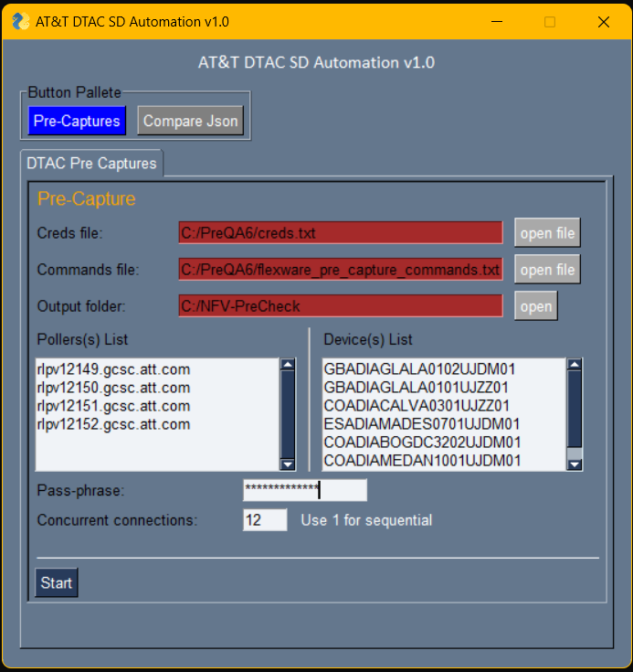

Capture Instructions
=================================================

Options
----------------

	``Initial One time Fixes``

	1. **creds.txt** file and its path ( Location fixed as **C:/PreQA6/creds.txt** ) 
		* creds File can be opened and edited by clicking open file button
		* edit it for the password one time.
		* need to add identifity (public key) file, which is used to login /authenticate for the poller login.
		* Remember to change the Forward slash **\\** to backward slash **/**.
		* Any input beginning with tab will be considered as remark in creds file.
		* all other input values should be withing double quote. Ex **"ABC"**

	2. **commands list text file** ( Fixed as C:/PreQA6/flexware_pre_capture_commands.txt ) --> File can be opened and edited by clicking open file button
		* commands list can be opened and edited as desired by clicking open file button.
		* some predefined commands are listed there, Add more as desired. (Kindly do not remove any predefined commands some of them are mandatory for validation and output CSV/Excel generations.)
		* while editing maintain given hierarcy. only add commands you desired in specific hierarcy
		* do not remove hierarcy even if it doesn't have any commands 

	3. **output folder** ( Location fixed as **C:/NFV-PreCheck** ) 
		* Folder can be access quickly by clicking open button
		* Outputs will be stored in above folder.  And Everytime when executed, it will create a <DATE> folder / <TIME LT> folder inside it. And All output files will reside within it. 

	``Modify only if need``

	1. **Pollers List** 
		* 4 - Pollers are added as of now
		* it Can be modified as need
		* Pollers will be selected on round robin bases to and help distribute load across them. It will access the devices parallelly if multiple devices provided

	``Input require each time``

	1. **Devices** (Hostname) List
		* it can be JZZ, JDM names
		* N-Number of devices can be entered. But parallel processing has been capped at 12 devices. 
		* Providing more than 12 devices will be executed, but in multiple of batch of 12s.

	2. **passphrase**: (optional) 
		* Provide if it is set while public/private key pair generation.

-----------------

* **Creds.txt** and **flexware_pre_capture_commands.txt** sample files are uploaded along with script. Copy it to provided path above.

Steps
---------------

* Click on Start to start executing scipt once all necessary inputs are entered.
* Execution progress can be seen on console/command prompt. 

* Press - CTRL+C  to terminate the job.
* Press - Esc or "X" top right button to close. 

