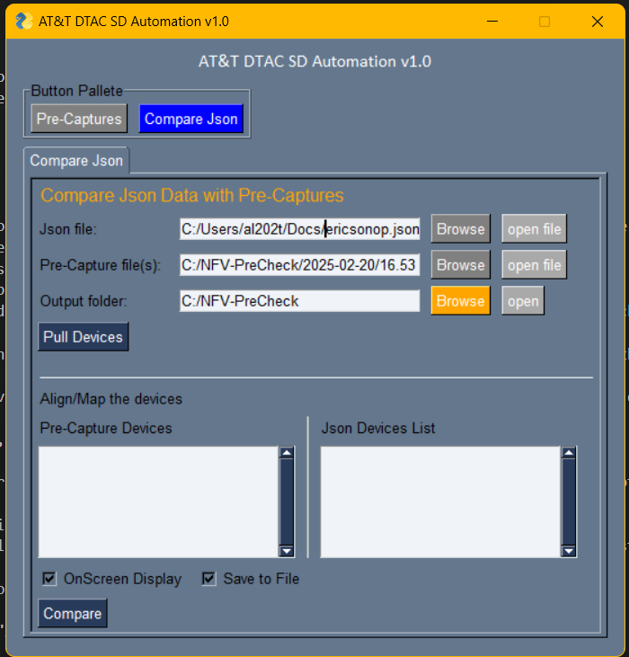

JSON Compare Instructions
=================================================

Requirements
----------------
	1. json data output from Ericsson portal
	2. Pre-capture results (.log files) for the devices

Steps
-------------

	``Fixed Inputs``

	1. **Output Folder** ( Fixed as **C:/NFV-PreCheck** )
		* Folder can be access quickly by clicking open button
		* Output will be stored under **C:/NFV-PreCheck/<DATE>**  Folder.

	``Input require each time``

	1. *Ericsson portal*.  > Select device. > Select top level  > Save  **data json** output to a file.
		* Extension of files should be **.json**  
		* Select this **Json File** as first input

	2. *Capture the output* of the devices using Pre-Capture tab.
		* Select captured devices *.log* files as second input.
		* can be select a single or multiple devices.

	3. Click ``Pull Devices`` button. 
		* This will pull the devices details and display in two device lists windows.

	4. Map the devices between pre-capture list v/s json list ( if require )
		* Mapping to be done horizontally.
		* Move/shuffle device up/down using cut-paste if require.

	5. Click on ``Compare`` button. 

	``Optional Inputs``

	1. **Onscreen display** checkbox - to see result in console window
		* Result will appear on command/console window  and/or to output file based on additional option selected.
	2. **Save to file**  - to write output to a text output file.	
		* output file name will be starting 13 characters from a device hostname

* Press - Esc or "X" top right button to close. 

